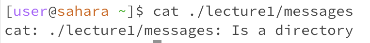
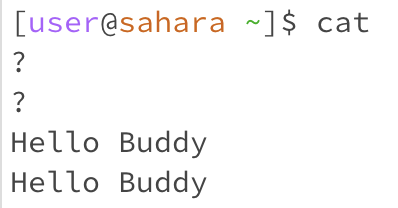
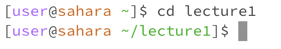
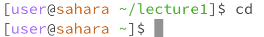
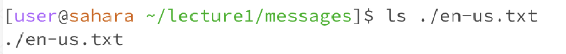

For each of the commands cd, ls, and cat, and using the workspace you created in this lab:

Share an example of using the command with no arguments.
Share an example of using the command with a path to a directory as an argument.
Share an example of using the command with a path to a file as an argument.
So that's 9 total examples (3 for each command). For each, include:

A screenshot or Markdown code block showing the command and its output - x
What the working directory was when the command was run
A sentence or two explaining why you got that output (e.g. what was in the filesystem, what it meant to have no arguments).
Indicate whether the output is an error or not, and if it's an error, explain why it's an error.

# CSE 15L LAB Report #1 - Fnu Anu

 # **`Cat` Command:**
1) `Cat` with a path to a directory:
   
 PWD: 
 
 

3) `Cat` with a path to a file:
   
 PWD: 
 
 

4) `Cat` with no args:
 PWD:

   
   ___
   
    ## **`CD` Command:**
1) `CD` with a path to a directory:
   
    PWD:

   

   
3) `CD` with a path to a file:

    PWD:

   

      
5) `CD` with no args:

    PWD:

   

   
   ___

   ### **`ls` Command:**
1) `ls` with a path to a directory:

    PWD:

   

3) `ls` with a path to a file:

    PWD:

   

   
5) `ls` with no args:
   
    PWD:

   
      
   ___
   
