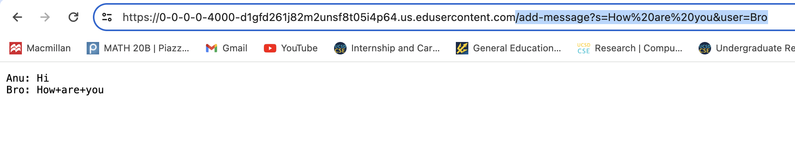

# CSE 15L LAB Report #1 - Fnu Anu
## Part 1:
Below are the two screenshots of my code file:

Then, I used javac and java command appropriately like such to open a server:

Here are the two screenshots of me adding /add-message?s=<string>&user=<string> to the server url and here were the results:

1) Below I entered 'Hi' as message and 'Anu' (my name) as the user.

2) Secondly, I entered 'How are you' as the message and 'bro' as the user.

As a result, we saw that the string keeps being updated and saved even when we add more messages by different or various users.

For each of the two screenshots, describe:

**1st screenshot:**
1. Which methods in your code are called? `Main` method from `ChatServer` class in order to open the server and `handleRequest` method from `Handler` class is used to perform identified requests with message and user here similar to num being incremented in NumServer everytime we entered /increment or /add.
   
2. What are the relevant arguments to those methods, and the values of any relevant fields of the class? The relevant argument for main method was the port number being identified after `javac ChatServer` where after `ChatServer`, this `main` method is trying to identify the port number which in my case is 4000. The `port` from main method is one of the relevant fields that change based on the port number entered by the user, so the server number that the user is connected to will change accordingly. As for the `Handler` class, url of the server that we open in the browser is the parameter to handleRequest method where if certain patterns are found in queries, such special characters can be used to split apart the contents that we need. So the url would be different when I enter `/add-message?s=How are you&user=Bro` as parameter than when I enter `/add-message?s=Hi&user=Anu`. The relevant field is `start` which is an empty string, but eventually gets updated and added with information of message and the user accordingly. 

3. How do the values of any relevant fields of the class change from this specific request? If no values got changed, explain why.

**2nd screenshot:**
1. Which methods in your code are called? `Main` method from `ChatServer` class in order to open the server and `handleRequest` method from `Handler` class is used to perform identified requests with message and user here similar to num being incremented in NumServer everytime we entered /increment or /add.
   
2. What are the relevant arguments to those methods, and the values of any relevant fields of the class? The relevant argument for main method was the port number being identified after `javac ChatServer` where after `ChatServer`, this `main` method is trying to identify the port number which in my case is 4000. The `port` from main method is one of the relevant fields that change based on the port number entered by the user, so the server number that the user is connected to will change accordingly. As for the `Handler` class, url of the server that we open in the browser is the parameter to handleRequest method where if certain patterns are found in queries, such special characters can be used to split apart the contents that we need. So the url would be different when I enter `/add-message?s=How are you&user=Bro` as parameter than when I enter `/add-message?s=Hi&user=Anu`. The relevant field is `start` which is an empty string, but eventually gets updated and added with information of message and the user accordingly. 

3. How do the values of any relevant fields of the class change from this specific request? If no values got changed, explain why.

Values get changed in such way -
Since the url as an argument gets altered being the same until `/add-message?s=who are you&user=Bro`
so the query gets split initially by `&`, `parameters` storing `s=who are you` (parameter 0) and `user=Bro`(parameter 1). 
Then, `stringParameters1` allow split from `=`, making two parameters in this array which would be `s` and `who are you`. We don't need `s` other than for splitting purposes so we would not be storing it any further. Instead the local variable I made as `message`, I will update message to store `who are you` as `stringParameters1`[1].
   
### Part 2:
Using the command line, show with ls and take screenshots of:

1) The absolute path to the private key for your SSH key for logging into ieng6 (on your computer, an EdStem workspace, or on the home directory of the lab computer)
   

2) The absolute path to the public key for your SSH key for logging into ieng6 (this is the one you copied to your account on ieng6, so it should be a path on ieng6's file system)
   

3) A terminal interaction where you log into your ieng6 account without being asked for a password.

### Part 3: My Reflection on learning:
Something I had learned in Week 2 and Week 3 lab that I did not even knew was on how to open the server, make the handler requests or how to even write code to make the server perform some action like saving User and Message here or increment number and make it show up on the website. I also did not knew much on local computer terminal use and logging in using ieng6 to copy public key or without login, accessing private keys or even where the download files go or which path. In these two past weeks, I was able to use the skills about `cd`, `ls` and `cat` from week 1 into practical uses to perform other tasks, realizing the benefits and uses of those commands that we learned in week 1. 
