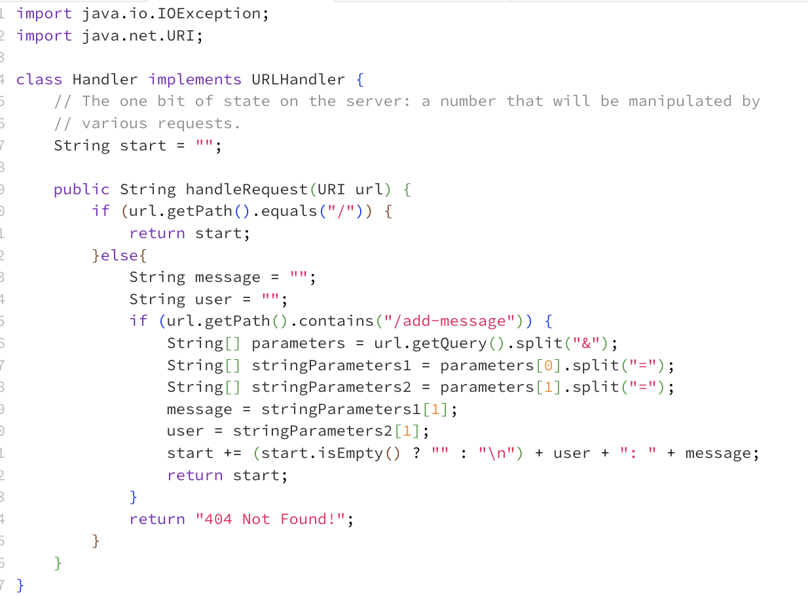
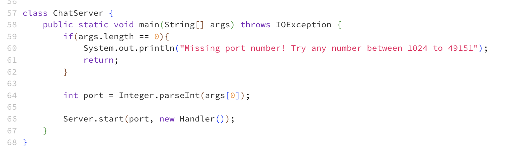
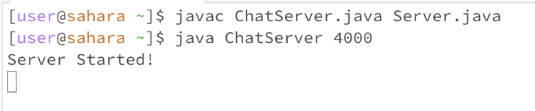

# CSE 15L LAB Report #1 - Fnu Anu
## Part 1:
Below are the two screenshots of my code file:

Then, I used javac and java command appropriately like such to open a server:

Here are the two screenshots of me adding /add-message?s=<string>&user=<string> to the server url and here were the results:

1) Below I entered 'Hi' as message and 'Anu' (my name) as the user.

2) Secondly, I entered 'How are you' as the message and 'bro' as the user.

As a result, we saw that the string keeps being updated and saved even when we add more messages by different or various users.

For each of the two screenshots, describe:

**1st screenshot:**
1. Which methods in your code are called? `Main` method from `ChatServer` class in order to open the server and `handleRequest` method from `Handler` class is used to perform identified requests with message and user here similar to num being incremented in NumServer everytime we entered /increment or /add.

   
2. What are the relevant arguments to those methods, and the values of any relevant fields of the class? The relevant argument for main method was the port number being identified after `javac ChatServer` where after `ChatServer`, this `main` method is trying to identify the port number which in my case is 4000. The `port` from main method is one of the relevant fields that change based on the port number entered by the user, so the server number that the user is connected to will change accordingly. As for the `Handler` class, url of the server that we open in the browser is the parameter to handleRequest method where if certain patterns are found in queries, such special characters can be used to split apart the contents that we need. So the url would be different when I enter `/add-message?s=How are you&user=Bro` as parameter than when I enter `/add-message?s=Hi&user=Anu`. The relevant field is `start` which is an empty string, but eventually gets updated and added with information of message and the user accordingly. 

3. How do the values of any relevant fields of the class change from this specific request? If no values got changed, explain why.

Values get changed in such way -

However, any relevant fields of ChatServer class won't change since the port number is already set form which we already opened and connected to the server so our alterations of the end by adding `message` and `user` would not impact the server to be modified unless we choose to press `ctrl+c` to end the server to connect to another one. Due to the handles being the only modfiication, the nits and bits as in the variables, fields and arguments inside the `Handler` class like the variables in `handleRequest` method would be the ones getting altered with new handle requests.

Since the url as an argument gets altered being the same until `/add-message?s=Hi&user=Anu`
so the query gets split initially by `&`, `parameters` storing `s=Hi` (parameter 0) and `user=Anu`(parameter 1). 

Then, `stringParameters1` allow split of message section from `=`, making two parameters in this array which would be `s` and `Hi`. We don't need `s` other than for splitting purposes so we would not care much about it. Using the local variable named as `message`, I will update message to store `Hi` as `stringParameters1`- parameter [1] since parameter[0] of this array holds "message" from the path.

Then, `stringParameters2` allow split of user section from `=`, making two parameters in this array which would be `user` and `Anu`. We don't need `user` other than for splitting purposes so we would leave it alone. Using the local variable I named `user`, I will update `user` to store `Anu` as `stringParameters2` - parameter [1] since parameter [0] holds "user" from the path. In the end, the `start` variable is being updated with new messages/info along with the past ones as we see the new changes as well as old ones on the browser.

**2nd screenshot:**
1. Which methods in your code are called? `Main` method from `ChatServer` class in order to open the server and `handleRequest` method from `Handler` class is used to perform identified requests with message and user here similar to num being incremented in NumServer everytime we entered /increment or /add.

   
2. What are the relevant arguments to those methods, and the values of any relevant fields of the class? The relevant argument for main method was the port number being identified after `javac ChatServer` where after `ChatServer`, this `main` method is trying to identify the port number which in my case is 4000. The `port` from main method is one of the relevant fields that change based on the port number entered by the user, so the server number that the user is connected to will change accordingly. As for the `Handler` class, url of the server that we open in the browser is the parameter to handleRequest method where if certain patterns are found in queries, such special characters can be used to split apart the contents that we need. So the url would be different when I enter `/add-message?s=How are you&user=Bro` as parameter than when I enter `/add-message?s=Hi&user=Anu`. The relevant field is `start` which is an empty string, but eventually gets updated and added with information of message and the user accordingly. 

3. How do the values of any relevant fields of the class change from this specific request? If no values got changed, explain why.

Values get changed in such way -

Any relevant fields of ChatServer class won't change since the port number is already set since last screenshot unless we choose to use `ctrl+c` to end the server. Due to the handles being the only modfiication, the variables, fields and arguments inside the `Handler` class and the variables in `handleRequest` method inside the `handler` class would be the ones getting altered with new handle requests.

Since the url as an argument gets altered being the same until `/add-message?s=who are you&user=Bro`
so the query gets split initially by `&`, `parameters` storing `s=who are you` (parameter 0) and `user=Bro`(parameter 1). 

Then, `stringParameters1` allow split of message section from `=`, making two parameters in this array which would be `s` and `who are you`. We don't need `s` other than for splitting purposes so we would not care much about it. Instead the local variable I made as `message`, I will update message to store `who are you` as `stringParameters1`- parameter [1] since parameter[0] of this array holds "message" from the path.

Then, `stringParameters2` allow split of user section from `=`, making two parameters in this array which would be `user` and `Bro`. We don't need `user` other than for splitting purposes so we would leave it alone. Instead the local variable I made as `user`, I will update `user` to store `Bro` as `stringParameters2` - parameter [1] since parameter [0] holds "user" from the path. Finally the `start` variable is being updated with new messages/info along with the past ones and showcase that outcome on the browser.

   
### Part 2:
Using the command line, show with ls and take screenshots of:

1) The absolute path to the private key for your SSH key for logging into ieng6 (on your computer, an EdStem workspace, or on the home directory of the lab computer)

As you can see below, I checked my working directory first when looking for the private key in my computer so I `cd` out of `CSE 15L` folder and my `Desktop` directory so I was left in `home` directory which for my computer is `/Users/simonscholar/`. Then, I `cd` into `.ssh/` and `ls` to see if it stored the key I was looking for. I found 3 various types, known_hosts which I ignored and recognized `id_rsa` as my private key file and `id_rsa.pub` as public file stored on my computer. Just to ensure, I `cat` `id_rsa` private key file and found gibberish and similarly with `id_rsa.pub`, containing less gibberish. The absolute path is `/Users/simonscholar/.ssh/id_rsa` for this case.

   

2) The absolute path to the public key for your SSH key for logging into `ieng6` (this is the one you copied to your account on ieng6, so it should be a path on ieng6's file system)

As you can see below, I was trying to find my public key on my account so when I was logged into `ieng6` account, I pretty much checked my files and folders by `ls` command. Then, I choose to go into `wavelet` since that's where it was said in the instructions to be stored so I `ls` again to see what files this directory holds. Then, I did `ls -a` to see if the authorized files might be hidden for obvious reasons, which I found nothing much. So I `pwd` to see where I was and found to be in this following path: `/home/linux/ieng6/oce/8k/fanu/wavelet/` so I `cd` out to home directory and found the `.ssh` file along with many others so I `cd` command into `.ssh` file and `ls` to find a file named `authorized_keys`. My path for this was `/home/linux/ieng6/oce/8k/fanu/.ssh/authorized_keys`. 

   

3) A terminal interaction where you log into your ieng6 account without being asked for a password.

Lastly, I followed the instructions from week 3 lab which was pretty much logging into `ieng6`, creating `.ssh` file using `mkdir` command. Then, we got the public key file path and used `scp` command which securely copies the files like keys and giving us an access after that process to enter without having to enter a password every time. As you can see below, this process worked and the terminal did not asked me this time to put in my password.

### Part 3: My Reflection on learning:
Something I had learned in Week 2 and Week 3 lab that I did not even knew was on how to open the server, make the handler requests or how to even write code to make the server perform some action like saving User and Message here or increment number and make it show up on the website. I also did not knew much on local computer terminal use and logging in using ieng6 to copy public key or without login, accessing private keys or even where the download files go or which path. In these two past weeks, I was able to use the skills about `cd`, `ls` and `cat` from week 1 into practical uses to perform other tasks, realizing the benefits and uses of those commands that we learned in week 1. 
