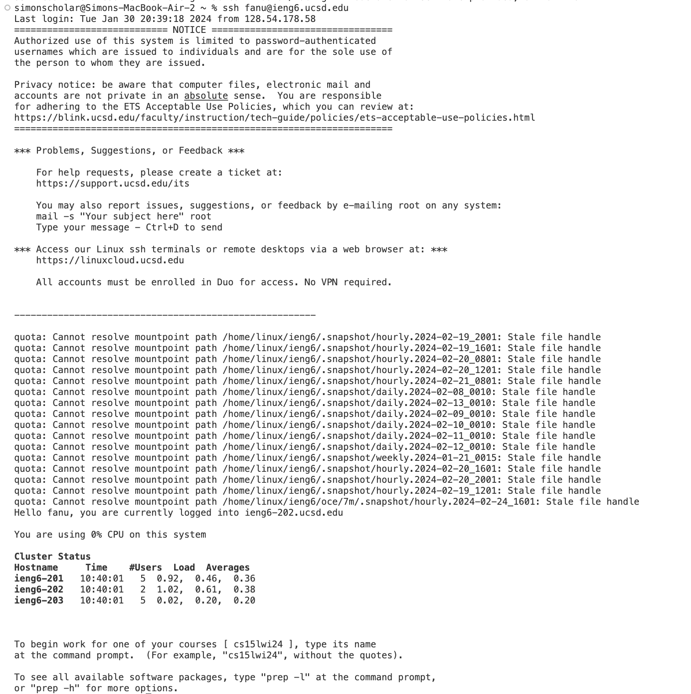
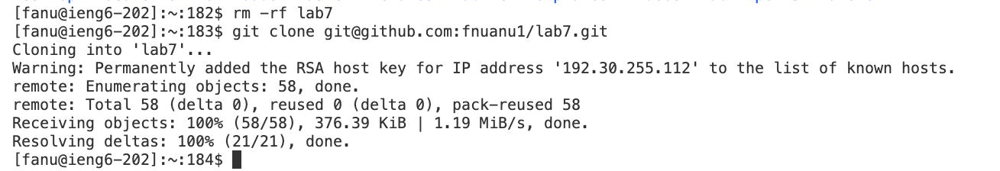
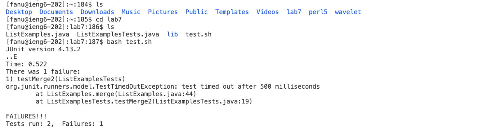
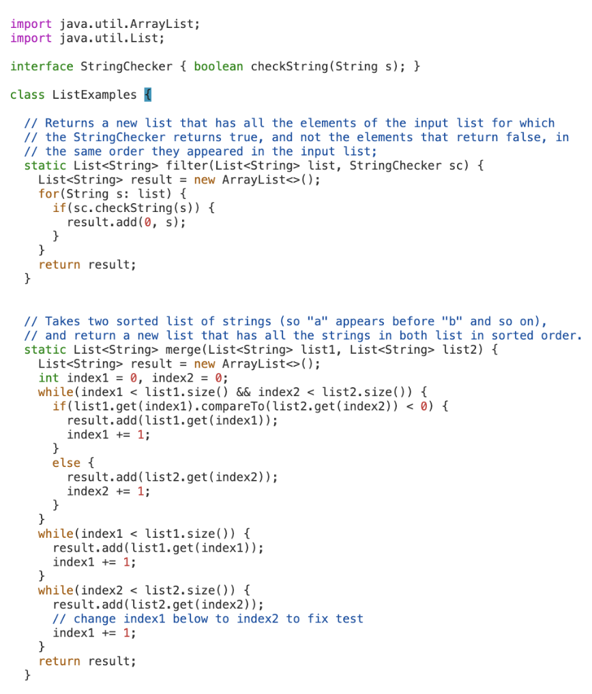
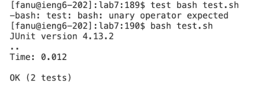
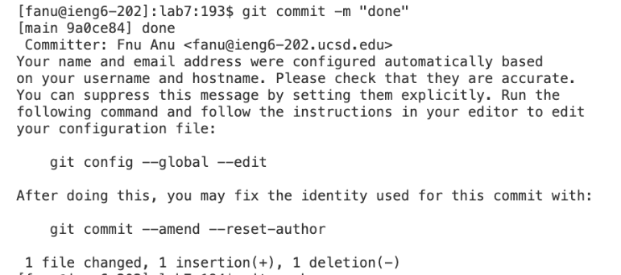
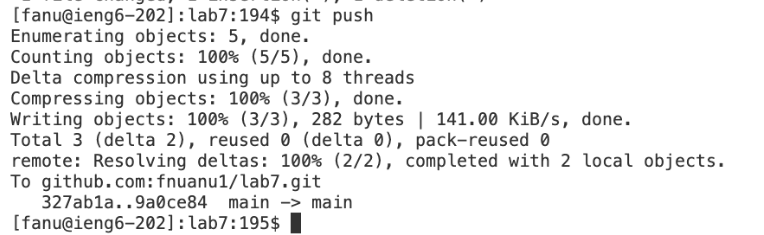
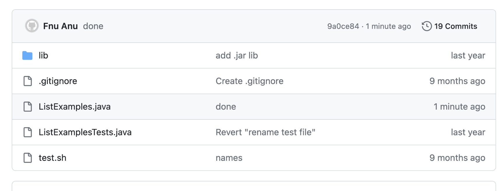

# CSE 15L LAB Report #4 - Fnu Anu
## Step 4: Log into ieng6 

Keys Pressed: `ssh fanu@ieng6.ucsd.edu <enter>` I was trying to log into my ieng6 account so I used this command in the terminal to access my account and use `<enter>` key press to get a bunch of lines about log in time, last login, notice, suggestions and other things until I was ready to clone lab7.
Summary of Commands: The command I used here was ssh which is to provide secure connection between 2 computers and access contents and so forth.
Effect of Key Presses: `<enter>` key press was needed to allow me to process that command in terminal.

### Step 5: Clone your fork of the repository from your Github account (using the SSH URL)

Keys Pressed: On webpage, I did `<ctrl+c> `, switched back to VS Code terminal and I typed `git clone <ctrl+v> <enter>` From ctrl+v, this was outputted on that same command line in the teminal: `git@github.com:fnuanu1/lab7.git`. Here, I was trying to git clone the forked repository using the ssh url gotten from github webpage and then typed my `git clone` command & pasted the url.
Summary of Commands: I had already used `rm -rf lab7` to forcefully remove lab7 from my previous attempts on my ieng6 account. Mainly, I used `git clone` command to clone the repository from my github webpage account.
Effect of Key Presses: Here, I used <ctrl+c> to copy url, <ctrl+v> to paste/drop url into terminal and <enter> to make the command line processed in terminal. The effect of this is less time being wasted on my end to type in url tediously for any errors.

#### Step 6: Run the tests, demonstrating that they fail

Keys Pressed: typed `ls <enter>` to list the directories or files to see if lab7 was cloned properly, typed `cd lab7 <enter>` to change directories to `lab7`, typed `bash test.sh <enter>` to run the command lines bashscript written in test.sh, which is pretty much compiling and running the java tests on the code.
Summary of Commands: In this step, I used three different commands, `ls`, `cd` and `bash` where `ls` - to confirm lab7 being cloned as listed in as the output. I changed directories into `lab7` directory and then run the `tets.sh` file which is ran by `bash command`.
Effect of Key Presses: As for the key presses here, I only used <enter> which is to process the command lines including `ls` to `cd` to `bash` commands as I type them into the terminal and use <enter> key press so to access and run the test files to see if tests failed or passed in this scenario.

##### Step 7: Edit the code file to fix the failing test

Keys Pressed: typed `vim ListExamples.java <enter>` and then file's contents opened, `<down> <down> <down> <down> <down> <down> <down> <down> <down> <down> <down> <down> <down> <down> <down> <down><down> <down> <down>` (19 times to get my cursor to the right position of error), typed `cl` as text and then insert mode was activated, so I changed `index1` to `index2` by <delete> or backspacing the last character `1` to swap it with `2` for variable `index2`, and finally, I hit `<esc> <shift ;> wq <enter>`. By the way, <shift+;> will output `:`.
Summary of Commands: Here, I used `vim` command to get into the file, ListExamples.java and edit it to correct code. In vimmed file, I used down arrows to get to correct location. Then I typed `cl` to activate `insert` mode in vim and correct the actual index. After being done, I used shift+; and then type wq and <enter> to allow this action to be processed so that the changes are saved and quitted back to terminal where it was left off as.
Effect of Key Presses: I think the only special key I pressed was `<down>` and `<shift+;>` which allowed me to get the cursor to wherever I want to make changes. In general, I realized that I can also click anywhere here directly just like in a file wherever I want to make changes. The `<shift+;>` is essential to be able to write the combination of wq which is to save and quit the vim command.

###### Step 8: Run the tests, demonstrating that they now succeed

Keys Pressed: typed `bash test.sh <enter>` to re-run the command lines bashscript written in test.sh of lab7; same bashscript (no changes made) as in step 6.
Summary of Commands: `bash` command is used here to run the same set of commands written in this script file of test.sh except we don't have to cd into `lab7` prior to running bash since we are already in this directory.
Effect of Key Presses: <enter> key press was used here after `bash test.sh` was typed so to make the commands actually be run and we learn if all tests were passed, which was yes as shown in the image.

###### Step 9: Commit and push the resulting change to your Github account (you can pick any commit message!)

Keys Pressed: typed `git add . <enter>` to stage files, Next line: typed `git commit -m "done" <enter>` (to take snapshot of changes that were saved and made), Next line: `git push <enter>` (pushes the local repository to remote one - the one on our github webpage).
Summary of Commands: There are 3 various types of git commands we used here as desribed above. We used `git add .` to stage files, meaning that you are telling the terminal or preparing to push permanent changes to the repository's files. The `git commit -m "done"` is the command where "done" is the comment made when the git push is successfully made. Regardless, the said comment is returned right after I entered this command line and then information about me as in who will be pushing out these changes is returned as a confirmation way of your identity. Then, lastly, `git push` is used to make any changes to the remote repository as well, which is the one we forked on our account's github webpage.
Effect of Key Presses: <enter> was the special key press that I used other than typing all these details so multiple commands were responsible for processing and saving content changes as part of this step.

###### Final Screenshot of "done" message on github webpage:

Overall Command Summary and Key Presses Effect: The commands like `git add`, `git commit`, `git push`, `ls`, `cd`, `pwd`, `ssh`, `git clone`, `bash` and `vim`. As described above the details or summary of each of these commands, we overall used these commands to access account, clone respositories, access directories, change contents of the file, run the tests and push out those changes. The effect of Key Presses in general seems to shorten the time I spent typing each character so here, I realized that just like I used `<ctrl+c>` and `<ctrl+v>`, I must use other key presses to help me shorten the time it takes for me to complete a possible change in vim or in terminal so I should get in the habit of using `<tab>` and other shortcuts. Most of the time, I was just using `<enter>`, which allows the command line to be inputted and an output is produced accordingly through any of these commands used.
