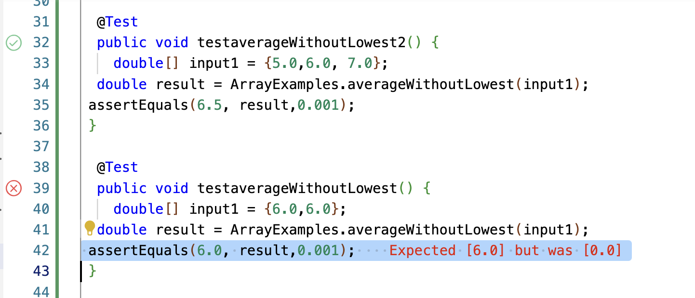
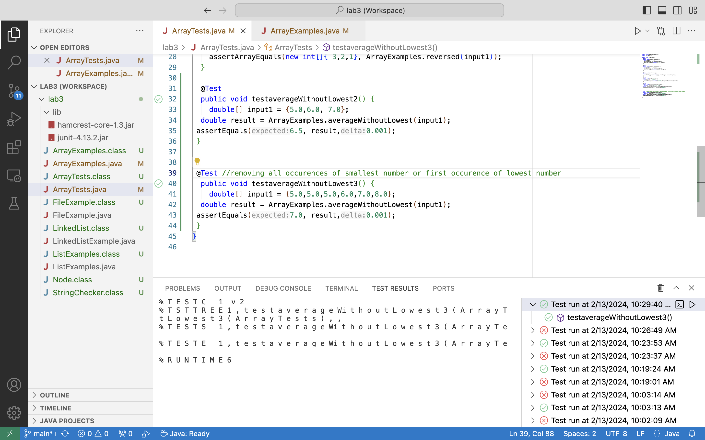

# CSE 15L LAB Report #2 - Fnu Anu
## Part 1: BUGS - `averageWithoutLowest` method!!!
1) Failure-inducing input: A tutor told me that I can either remove all occurences of that lowest number or choose to ignore the first occurence of the lowest number so I chose to remove/exclude all occurences of the lowest number in a given list since it is still the lowest number regardless of how many times it occurs. As shown below, {6.0, 6.0} is the failure-inducing input since the test already given seems (by class file) to expect 6.0 when 0.0 is the actual average expected without lowest numbers.

   


The code for method `averageWithoutLowest` is missing the iteration of keeping track instead of only ignoring the first occurence index:
```
static double averageWithoutLowest(double[] arr) {
    if(arr.length < 2) { 
      return 0.0; 
    }
    double lowest = arr[0];
    for(double num: arr) {
      if(num < lowest) { 
        lowest = num; 
      }
    }

    double sum = 0;
    for(double num: arr) {
      if(num != lowest) {
        sum += num; }
    }
    return sum / (arr.length - 1); //THE PROBLEM is with subtracting only 1 and missing track of lowest number occurences!!! - same issue as the one below
  }
```

Particularly, the section that even when the test itself is written wrong for the way I choose to deal with case of multiple occurences, the size of array is never updated to exclude all occurences of lowest numbers so the error comes from the fact that when there are other numbers and not just multiple occurences of the lowest number in the list, the code is only removing 1 occurence instead of all occurence of lowest numbers, as I chose (SHOWN BELOW). So this example provided initially after cloning the directory is not personable to how I am handling this case. So I show another test example that I wrote myself, that applies to my case. Here, `{5.0, 5.0, 5.0, 6.0, 7.0, 8.0}` is the failure-inducing input that causes the error with code and actually calculates `4.2` when it is expecting `7.0` as the result value. As shown below, this induces failure in our J-Unit test and requires debugging.


I have marked down the problem in the code block below!

```
static double averageWithoutLowest(double[] arr) {
    if(arr.length < 2) { 
      return 0.0; 
    }
    double lowest = arr[0];
    for(double num: arr) {
      if(num < lowest) { 
        lowest = num; 
      }
    }

    double sum = 0;
    for(double num: arr) {
      if(num != lowest) { 
        sum += num; }
    }
    return sum / (arr.length - 1); //THE PROBLEM is with subtracting only 1 and missing track of lowest number occurences!!!
  }
```

2) An input that doesn't induce a failure - {5.0, 6.0, 7.0} is the non-failure inducing input that expects and actually calculates to be 6.5 regardless of an existent bug since there are not duplicate occurences of 5.0, the lowest number, in this case. As shown below in the screenshot, the test passes and the associated code is just loop, ignoring the occurence of lowest number so only one needed to be removed as 5.0 is the only one not counted towards dividing the sum by that number.


   
```
static double averageWithoutLowest(double[] arr) {
    if(arr.length < 2) { 
      return 0.0; 
    }
    double lowest = arr[0];
    for(double num: arr) {
      if(num < lowest) { 
        lowest = num; 
      }
    }

    double sum = 0;
    for(double num: arr) {
      if(num != lowest) { 
        sum += num; }
    }
    return sum / (arr.length - 1); //THE PROBLEM is with subtracting only 1 and missing track of lowest number occurences!!!
  } // However, since this input had only 1 occurence of lowest number and the code is subtracting 1 above this line, it works!!!
```

3) As shown above, the initial given test failed due to not applying at all to how I viewed the scenario, but it still would have failed for other reasons.

Initial failure-inducing input J-Unit Test (Not applied to my scenario): The symptom is the failure of the test since expectation vs. reality is different here!
   //First non-Applicable failure
   


Actual failure-inducing input J-Unit Test: The symptom is the failure of the test since I am expectation `7.0` when it tells me `4.2` is actually being calculated due to the wrong bug! 
   //For the actual case, the test failed screenshot of junit test
   


Passing J-Units after the fix: (The symptom is nothing other than both tests successful passing which it should as expected.)
   // For the third case, the test passed, but is not covering enough to see the fault in code.
   



4) As shown below, the bug remains in the first code below because the code does have any place where it calculates the amount of times the lowest number occurs in the list so it only accounts for subtracting the one time that the lowest number exists. After adding another loop of count being updated every time there is an occurence of lowest number, we can keep track of the appropriate number that needs to be subtracted instead of just subtracting 1.
BEFORE FIX:   
```
static double averageWithoutLowest(double[] arr) {
    if(arr.length < 2) { 
      return 0.0; 
    }
    double lowest = arr[0];
    for(double num: arr) {
      if(num < lowest) { 
        lowest = num; 
      }
    }

    double sum = 0;
    for(double num: arr) {
      if(num != lowest) { 
        sum += num; }
    }

    return sum / (arr.length - 1); // wrong count subtracted and thus, wrong divided
  }
```

Below is the corrected code as seen and this fixes the bug because since I want to not take account of any occurences of the determined lowest number in the list, I must keep track of how many times it occurs to subtract it since the code will be using the sum of 5 items in the list and dividing by (5 in addition to, for example 15 occurences of lowest number. This causes the divide part of calculating average to be calculated wrong, which we do not want.

AFTER FIX:

```
static double averageWithoutLowest(double[] arr) {
    if(arr.length < 2) { 
      return 0.0; 
    }
    double lowest = arr[0];
    for(double num: arr) {
      if(num < lowest) { 
        lowest = num; 
      }
    }

//added a way to keep track of how many times lowest number is repeated
    double count = 0;
    for(double num: arr) {
       if(num == lowest) { 
        count += 1; }
    }

    double sum = 0;
    for(double num: arr) {
      if(num != lowest) { 
        sum += num; }
    }

    return sum / (arr.length - count); //count is being subtracted instead now
  }

```

Therefore, this had allowed me to pass the J-Unit tests as shown below:


### Part 2: Researching Commands

From `less`, `find` and `grep`, I will be choosing `grep` as my topic to find the new ways of using `grep` that I am not aware of, even after the lecture.
1) General Format: `grep -n "pattern" file.txt`
   
   File argument: The input is `grep -n "journals" ./technical/plos/journal.pbio.0020001.txt`. The output is the following:

   CodeBlock OUTPUT:
```
110:        which are mutually exclusive. It is possible that publishing in international journals as a
126:        journals (
129:        the 20 top ecological journals (with impact factors of 10.51–2.47) (ISI 2001a). We credited
134:        For the top 20 ecological journals, the American subcontinents of South, Central, and
138:        data as contributions to the top 10 ecological journals (impact factors 10.51–3.31) versus
140:        twice as many publications to journals in the second category (8% in the top 11–20 compared
142:        regions as Latin America are falling short of reaching the top journals. In contrast, the
143:        United States contributed somewhat more publications to the top 10 journals (84%) than the
144:        top 11–20 journals (79%). The difference in the proportion of publications contributed by
145:        the United States to the top 10 and top 20 journals was even more pronounced when we
147:        contributed 60% of the publications to the top 10 journals and only 40% of the publications
148:        to the top 11–20 journals.
152:        Nature were nearly identical to those of the top 20 ecological journals.
156:        versus 6% in the top 20 ecological journals, whereas the United States and Canada had 81%
158:        American researchers are not shying away from the two top-ranked general science journals.
168:        international journals, despite its robust productivity as measured by the number of
174:        the top journals or become amongst the most cited researchers in their fields? One
176:        and that the top journals, which are published in the developed world, respond more to the
180:        journals share a similar economic region, they also share the same perception of what
181:        science is most interesting to them. Another consideration is that more local journals from
182:        developed regions are listed by the SCI than similar journals from developing regions
226:        target the journals that have the greatest impact. Although there may still be a long road
```


   Directory argument: The input is `grep -n "journals" ./technical/plos`. The output is the following:

   CodeBlock OUTPUT: (ERROR - this is an error because the file type is needed as an argument instead of directory since there is no way for the terminal to figure what line number is a certain file name at in the directory, which is the purpose of this type of command so the scenario of us trying to input a directory is not working.)
   
```
simonscholar@Simons-MacBook-Air-2 docsearch % grep -n "journals" ./technical/plos                     
grep: ./technical/plos: Is a directory
```

What is it doing and why is it useful: Above, the pattern described for the file works well and is able to indicate the line number in the output where "journals" word is used in that file, but the directory input leading to inner directory, `plos`, is not worked as expected due to it being an error as explained above.
This type of formatted command specifically prints out the line number that the said pattern is found at so it is not just lines, but their line number being printed alongside the line's content when some part of the content matches with the pattern we are looking for. This is useful so that we can locate the matched pattern line without much trouble through 1000s and millions of lines of data instead of going through it to find what line we need. 
   
2) General Format: `grep -E "apple|banana" fruits.txt`

   File argument: The input is `grep -E "Panama|money" ./technical/plos/journal.pbio.0020001.txt`. The output is the following:

   CodeBlock OUTPUT:
```
simonscholar@Simons-MacBook-Air-2 docsearch % grep -E "Panama|money" ./technical/plos/journal.pbio.0020001.txt
        Further analyses, correcting the number of overall publications for the amount of money
        research money available to researchers, Latin America actually out-published the United
        of publications per amount of money allocated to research and development in Latin America,
        performed particularly well. For example, Uruguay, Chile, Panama, and Cuba averaged,
        activities, however, requires a greater proportion of research money being spent on
        publications, especially when corrected for the amount of money available in research and
```

   Directory argument: The input is `grep -E "Panama|money" ./technical/plos`. The output is the following:

   CodeBlock OUTPUT: (ERROR because this command type is also not able to generally apply to find file types in a given directory as we might expect it to so it needs a file type instead.)
   
```
simonscholar@Simons-MacBook-Air-2 docsearch % grep -E "Panama|money" ./technical/plos                         
grep: ./technical/plos: Is a directory
```
What is it doing and why is it useful: Above, as shown, the file argument into `grep` command processed well and found Panama or money and printed that entire line. As for the directory input, it had not worked in our favor yet again since this command specific still requires a file instead of the directory as the error above indicates possibly because `grep` command is not able to roll through files in the directory and see if they all contain the said patterns or not or possibly if the file name even matches the said patterns or not, which is a possible issue. Therefore, I did not even bothered changing the pattern to fit a possible file type in `plos` directory from my initial attempt on file argument.
This type of formatted command specifically prints out the lines that are matching either pattern that is separated through the use of vertical bar in the initial command line instead of just one pattern alone. This is useful when we are looking multiple patterns at the same time because they might be referring to the same thing. For example, we can say `grep` command to find `banana` pattern or the exact text `The fruit minions love eating` which is obviously bananas so something like this can be easily referred to.

3) General Format: `grep -i "pattern" file.txt`
   File argument:  The input is `grep -i "Annan" ./technical/plos/journal.pbio.0020001.txt`. The output is the following:

   CodeBlock OUTPUT: 
```
simonscholar@Simons-MacBook-Air-2 docsearch % grep -i "Annan" ./technical/plos/journal.pbio.0020001.txt
        Kofi Annan, the Secretary-General of the United Nations, recently called attention to
        the world scientific community closer to each other (Annan 2003). Mr. annan stressed the
        development itself.” Indeed, Mr. annan's sentiments have also been echoed recently by
        developing worlds actually remaining unchanged or even increasing, as Mr. Annan has
        Annan. There are many compelling reasons for the push to increase scientific input from the
        developing world (Goldemberg 1998; Annan 2003). One is that science, as a discipline, would
        to travel, we feel optimistic that the bridges mentioned by Mr. Annan are slowly being
```

   Directory argument: The input is `grep -i "Annan" ./technical/plos`. The output is the following:

   CodeBlock OUTPUT: (ERROR because `grep` command does not seem to allow directory arguments so it leaves this as an error and nothing would have been printed if the command input was processable/went through, but did not found any match files in the directory)
```
simonscholar@Simons-MacBook-Air-2 docsearch % grep -i "Annan" ./technical/plos                         
grep: ./technical/plos: Is a directory
```

What is it doing and why is it useful: As you can see above, this `grep` command argument-specific had allowed more freedom for the pattern being found to be discovered even when Annan or annan is found instead of `grep` command being sensitive, now it is insensitive. As expected, the directory argument again gives us an error as explained above since the command does not take in directory path as arguments and how it will process as the same file can exist in different file formats like .java, .txt and so forth if the pattern is as vague as "annan". By the way, since I expected the error, I did not bothered changing the pattern for directory input to some specific file name in case, `grep` command will run through the whole directory and its files since we have been able to identify the general limits here of this command.
This type of formatted command specifically prints out the lines that match the pattern irrespective of the case, meaning that whether the pattern is lowercase or uppercase does not matter when you use this command type since it will find and print out all. This can be helpful to find patterns, not caring about if some patterns are lowerCase or upperCase as typos or not since this command will allow `grep` to be insensitive instead of being sensitive, meaning specific to exactly what it is asked of.

4) General Format: `grep -c "hosting" redswitches.txt`
   File argument: The input is `grep -c "Annan" ./technical/plos/journal.pbio.0020001.txt`. The output is the following:
   
   CodeBlock OUTPUT:
```
simonscholar@Simons-MacBook-Air-2 docsearch %  grep -c "Annan" ./technical/plos/journal.pbio.0020001.txt
6
```


  Directory argument: The input is `grep -c "Annan" ./technical/plos`. The output is the following:

   CodeBlock OUTPUT: (ERROR because the file type is expected by the terminal when using this command because the directory would not know exactly what are trying to check, the contents of those files for the word, "Annan", or the file names itself, but also the scope of grep as far as I know up until now is not towards directories, but specific files- argument path to a file)
   
```
simonscholar@Simons-MacBook-Air-2 docsearch % grep -c "Annan" ./technical/plos  
grep: ./technical/plos: Is a directory
```

What is it doing and why is it useful: As you can see and explained above, we had another error about the directory argument being a directory where file type path was expected of us since `grep` command would not know how to process a pattern in a directory, whether it is expected to check file names in directory or the content inside of the various files in the directory. I used the same pattern, "Annan", for this file search as well and as predicted, "Annan" appeared 6 times ("annan" is not counted here since we are not using -i here or that type of specific command). 
This type of formatted command specifically prints out the number of times the searched pattern is found within the given file, almost like what we do with ctrl+F to find something, their location, but it also gives us the amount of times that word is located in a given page. Therefore, it is almost like a word count except for patterns. This is useful to find the number of times a pattern occurs to learn its relevancy and so forth if you are trying analyze or take care of certain patterns showing up or for analyzation purposes.

#### Acknowledgement: 

I would like to axknowledge ChatGPT to help me find these ways above.
Citation: `CitOpenAI. (2023). ChatGPT (Mar 14 version) [Large language model]. https://chat.openai.com/chat`

- The prompts I gave to ChatGPT was "Tell me four unique ways or alternative ways of using `grep` command".
- Its output was general, but exactly like this below:

```
Let's explore the grep command, which is used for searching text patterns in files. Here are four interesting command-line options or alternate ways to use grep:

1) Recursive Search with -r or -R option:
The -r or -R option allows grep to recursively search through directories. This is handy when you want to search for a pattern not just in a single file, but in all files within a directory and its subdirectories.

grep -r "pattern" directory

2) Ignoring Case with -i option:
Sometimes you may want to search for a pattern irrespective of the case. The -i option makes grep case-insensitive.

grep -i "pattern" file.txt

3) Using Regular Expressions:
grep supports powerful regular expressions for pattern matching. This allows for more complex and flexible search patterns.

Example:
grep "^[0-9]*$" file.txt

4) Displaying Line Numbers with -n option:
If you want to see the line numbers along with the matching lines, you can use the -n option.

grep -n "pattern" file.txt
These are just a few examples of how grep can be used with different options to enhance its functionality.
```
//ENDS OF CHATGPT OUTPUT

How I altered the original output: I expanded on these general ideas to test them out for myself and make them personable, and even expand furthermore, into some of these ideas and find new ones since `grep -r` is a general command that we had  already covered so I have not completely taken ideas for how it is and made ChatGPT expand on their specifics, and simply asking to find "more new ways" to get the ones I incorporated, their purpose and application.

In addition, I used this website's idea to use -c to get the number count on the repitition of the said pattern that is chosen. 
APA Citation: 

```
Narendra. (2024, January 31). 10 unique use cases of GREP command in linux. RedSwitches. https://www.redswitches.com/blog/grep-command-in-linux/#:~:text=of%20the%20command%3A-,Search%20All%20Directories%20for%20a%20String,with%20all%20the%20other%20subdirectories.
```
